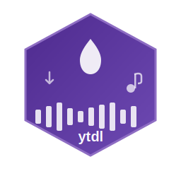

<div align="center">
  

  # YoutubeAudioDl

  Download high-quality audio from YouTube videos as MP3 files using Elixir and exyt_dlp.
</div>

## Features

- 🎵 **Downloads audio from YouTube videos** - High-quality MP3 conversion
- 🎭 **104 music genres** - Pre-configured genre search (lofi, jazz, rock, classical, etc.)
- 🔍 **Smart search** - Built-in YouTube search with metadata extraction
- ⏱️ **Duration filtering** - Avoid long livestreams with min/max duration filters
- 💾 **Per-genre caching** - Separate DETS cache files prevent duplicate downloads
- 🎨 **Two UX modes** - CLI mode (fast/scriptable) + Interactive mode (user-friendly)
- 🧹 **Auto-cleanup** - Removes intermediate files, sanitizes filenames
- 📊 **Cache management** - View stats, clear per-genre, track what you've downloaded

## Quick Start

### Installation

#### 1. Install system dependencies

**uv (Python package manager):**
```bash
curl -LsSf https://astral.sh/uv/install.sh | sh
```

**yt-dlp:**
```bash
~/.local/bin/uv tool install yt-dlp --force
yt-dlp --version  # Verify
```

**ffmpeg:**
```bash
# Ubuntu/Debian
sudo apt-get update && sudo apt-get install -y ffmpeg

# macOS
brew install ffmpeg

# Verify
ffmpeg -version
```

#### 2. Install C++ build tools (for DSP filters)

```bash
# Ubuntu/Debian
sudo apt-get install -y build-essential g++ cmake libasound2-dev

# Verify
g++ --version
```

#### 3. Install Python + ML dependencies (for onset detection)

```bash
# Create Python virtual environment
cd youtube_audio_dl
python3 -m venv ml_env

# Activate and install packages
ml_env/bin/pip install --upgrade pip
ml_env/bin/pip install cython numpy
ml_env/bin/pip install madmom scipy mido

# Verify installation
ml_env/bin/python -c "import madmom; print('Madmom installed successfully')"
```

**What gets installed:**
- **Madmom**: Neural network-based onset detection (pre-trained models)
- **NumPy**: Numerical computing
- **SciPy**: Scientific computing
- **Cython**: C-extensions for Python (required by Madmom)
- **MIDO**: MIDI file handling

**Note:** No GPU required! CPU-only processing works great (~1-2 seconds for 15 seconds of audio).

#### 4. Install Elixir dependencies

```bash
cd youtube_audio_dl
mix deps.get
mix compile
```

### Usage

#### Option 1: Interactive Mode (Recommended for beginners)

```bash
./ytdl-interactive
```

Features visual menus, step-by-step prompts, and built-in help.

#### Option 2: CLI Mode (Fast & scriptable)

```bash
# Browse genres
./ytdl genres

# Browse lofi music (with duration filter!)
./ytdl browse lofi 5 --max-duration 600

# Download single track
./ytdl download jazz --index 3

# Download multiple tracks (filter recommended!)
./ytdl download lofi --count 5 --max-duration 900

# Search custom query
./ytdl search "epic orchestral music" 10 --max-duration 1800

# Download from URL
./ytdl get "https://www.youtube.com/watch?v=VIDEO_ID"

# Check cache
./ytdl cache

# Clear cache for genre
./ytdl clear lofi
```

## CLI Options

```
--index N           Download Nth search result (default: 1)
--count N           Download N tracks
--limit N           Number of search results (default: 5)
--min-duration N    Minimum duration in seconds
--max-duration N    Maximum duration in seconds
--force             Skip cache check, re-download
--output DIR        Output directory (default: downloads)
```

## Duration Filtering (Important!)

**Many search results are long livestreams (6+ hours).** Use duration filters to avoid timeouts:

```bash
# Only short tracks (under 10 minutes)
./ytdl download lofi --count 5 --max-duration 600

# Only 3-15 minute videos
./ytdl download jazz --count 5 --min-duration 180 --max-duration 900

# Browse with filter
./ytdl browse classical 10 --max-duration 1800
```

**Duration reference:**
- `180` = 3 minutes
- `300` = 5 minutes
- `600` = 10 minutes ⭐ **Recommended max for most genres**
- `900` = 15 minutes
- `1800` = 30 minutes

## Elixir API Usage

```elixir
# Start interactive shell
iex -S mix

# Browse genres
YoutubeAudioDl.Music.print_genres()

# Search with duration filter
{:ok, tracks} = YoutubeAudioDl.Search.search("lofi beats",
  min_duration: 180,
  max_duration: 600,
  limit: 10
)

# Download from genre
YoutubeAudioDl.Music.download(:lofi)
YoutubeAudioDl.Music.download(:jazz, index: 3)
YoutubeAudioDl.Music.download_multiple(:classical, 5)

# Download from URL
YoutubeAudioDl.download_audio("https://www.youtube.com/watch?v=VIDEO_ID")

# With options
YoutubeAudioDl.download_audio(url,
  category: "lofi",
  output_dir: "./music",
  force: true
)

# Cache management
YoutubeAudioDl.Cache.stats("lofi")
YoutubeAudioDl.Cache.all_stats()
YoutubeAudioDl.Cache.list_categories()
```

## Music Genres (104 Total)

### Quick Picks
- **Electronic**: `:lofi`, `:edm`, `:techno`, `:house`, `:synthwave`, `:ambient`, `:chillwave`
- **Jazz**: `:jazz`, `:smooth_jazz`, `:bebop`, `:cool_jazz`, `:jazz_fusion`
- **Rock**: `:rock`, `:classic_rock`, `:indie_rock`, `:punk_rock`, `:metal`
- **Classical**: `:classical`, `:baroque`, `:piano`, `:violin`, `:orchestra`
- **Hip Hop**: `:hip_hop`, `:rap`, `:trap`, `:boom_bap`, `:lofi`
- **Relaxation**: `:meditation`, `:sleep`, `:study`, `:spa`, `:nature_sounds`

**See all 104 genres:** `./ytdl genres` or `YoutubeAudioDl.Music.print_genres()`

## How It Works

1. **Search** - Uses yt-dlp's built-in YouTube search (`ytsearch:query`)
2. **Filter** - Optional duration filtering (min/max seconds)
3. **Cache Check** - Checks genre-specific DETS cache to prevent duplicates
4. **Download** - Downloads best audio stream via yt-dlp
5. **Convert** - Converts to MP3 using ffmpeg (48kHz, best quality)
6. **Sanitize** - Cleans filename (removes spaces, special chars)
7. **Cache** - Marks URL as downloaded in genre cache
8. **Cleanup** - Removes intermediate files (.part, .webm, etc.)

## Caching System

### Per-Genre DETS Files

Each genre gets its own cache file for organization and performance:

```
downloads/
├── .cache/
│   ├── lofi          # DETS cache for lofi downloads
│   ├── jazz          # DETS cache for jazz downloads
│   ├── classical     # etc...
│   └── general       # Default category
└── *.mp3             # Your music files
```

### Cache Commands

```bash
# View cache statistics
./ytdl cache

# Clear specific genre cache
./ytdl clear lofi

# Clear all caches
./ytdl clear all
```

### Cache API

```elixir
# Check if URL is cached
YoutubeAudioDl.Cache.downloaded?("https://youtube.com/watch?v=...", "lofi")

# Mark as downloaded
YoutubeAudioDl.Cache.mark_downloaded(url, "jazz")

# Get stats
YoutubeAudioDl.Cache.stats("lofi")
YoutubeAudioDl.Cache.all_stats()

# List all categories
YoutubeAudioDl.Cache.list_categories()

# Clear cache
YoutubeAudioDl.Cache.clear_all("lofi")
```

## File Organization

```
youtube_audio_dl/
├── ytdl                    # Main CLI script
├── ytdl-interactive        # Interactive mode script
├── assets/                 # Brand assets
│   └── youtube_audio_dl.svg # Project logo
├── downloads/              # Downloaded MP3s (gitignored)
│   ├── .cache/            # DETS cache files
│   └── *.mp3              # Your music
├── ml_env/                # Python virtual environment (gitignored)
│   ├── bin/               # Python executables
│   ├── lib/               # Installed packages (madmom, numpy, scipy)
│   └── ...
├── simple_filter/          # C++ DSP pipeline
│   ├── dsp_pipeline.h     # Core DSP classes (filters, FFT, normalizers)
│   ├── dsp                # CLI helper script (./dsp hp 2k)
│   ├── filter             # 4-pole Butterworth filter tool
│   ├── normalize          # Peak/RMS normalization tool
│   ├── pipeline_demo      # 13-stage filter demonstration
│   ├── onset_detector     # Spectral onset detection (FFT-based)
│   ├── README_DSP.md      # DSP pipeline documentation
│   ├── NORMALIZATION_GUIDE.md  # Normalization theory & usage
│   └── TEST_RESULTS.md    # Performance benchmarks
├── simple_filter_demos/   # Generated filter outputs (gitignored)
│   ├── 01_original.wav    # Reference (no processing)
│   ├── 04_bandpass_kick.wav   # Isolated kick drum (60-200Hz)
│   ├── 05_bandpass_snare.wav  # Isolated snare (800-3000Hz)
│   ├── 07_lowpass_800hz.wav   # Lofi effect
│   ├── 13_combined_clean.wav  # Broadcast quality
│   └── ... (13 total stages)
├── scripts/               # Demo & utility scripts
│   ├── find_chops.exs     # Two-stage threshold chop detector (Elixir)
│   ├── find_hihat_chops.exs # Hi-hat specific chop detector
│   ├── find_kick_chops.exs  # Kick drum specific chop detector
│   ├── chop_ml.py         # ML-based chop detector (Madmom RNN)
│   └── demo_parameters.exs  # Parameter examples for chop detection
├── lib/
│   ├── youtube_audio_dl.ex           # Main module
│   └── youtube_audio_dl/
│       ├── search.ex                 # YouTube search + metadata
│       ├── music.ex                  # Genre presets (104 genres)
│       ├── cache.ex                  # DETS cache management
│       └── audio/                    # Audio processing
│           ├── transient_detector.ex # Beat detection
│           └── waveform_slicer.ex    # Audio slicing
├── docs/                  # Documentation
│   ├── QUICK_START.md     # Getting started guide
│   ├── TROUBLESHOOTING.md # Common issues & solutions
│   ├── CACHE_GUIDE.md     # Cache management guide
│   ├── MUSIC_EXAMPLES.md  # API usage examples
│   ├── TWO_STAGE_CHOP_GUIDE.md # Chop detection documentation
│   └── TRANSIENT_DETECTION_TECHNOLOGIES.md # Audio analysis tech overview
├── test/                  # Elixir tests
├── mix.exs
├── mix.lock
├── .formatter.exs
├── .gitignore
└── README.md              # This file (you are here)
```

## Examples

### Browse Before Downloading

```bash
# Check what's available and their durations
./ytdl browse lofi 10 --max-duration 600

# Pick a good short one (e.g., #3)
./ytdl download lofi --index 3
```

### Build a Music Library

```bash
# Download curated collection with filters
./ytdl download lofi --count 5 --max-duration 600
./ytdl download jazz --count 5 --max-duration 900
./ytdl download classical --count 3 --max-duration 1800
./ytdl download ambient --count 5 --max-duration 600

# Check what you've downloaded
./ytdl cache
```

### Elixir API

```elixir
# Download 5 lofi tracks (3-10 min each)
{:ok, tracks} = YoutubeAudioDl.Search.search("lofi beats",
  min_duration: 180,
  max_duration: 600,
  limit: 5
)

Enum.each(tracks, fn track ->
  YoutubeAudioDl.download_audio(track.url, category: "lofi_short")
end)
```

### Batch Download with Filtering

```elixir
# Download multiple genres, short tracks only
genres = [:lofi, :jazz, :classical, :ambient]

Enum.each(genres, fn genre ->
  IO.puts("\nDownloading from: #{genre}")

  # Search with duration filter
  {:ok, videos} = YoutubeAudioDl.Music.search(genre,
    limit: 3,
    max_duration: 600
  )

  # Download filtered results
  Enum.each(videos, fn v ->
    YoutubeAudioDl.download_audio(v.url, category: to_string(genre))
  end)
end)
```

## DSP & Audio Processing

### C++ DSP Pipeline (`simple_filter/`)

Professional-grade audio processing tools with composable filter chains:

#### Command-Line Tools

**Filter Tool** - Apply IIR filters with automatic normalization
```bash
cd simple_filter

# Lowpass filter at 800Hz
./dsp lp 800

# Highpass filter at 2kHz
./dsp hp 2k

# Bandpass filter (isolate frequency range)
./dsp bp 800 3000

# Custom input/output
./dsp hp 4000 my_drums.wav filtered.wav
```

**Normalizer** - Peak and RMS loudness normalization
```bash
# Peak normalize to -0.1 dB (maximizes volume)
./normalize input.wav

# RMS normalize to -14 dB (streaming standard)
./normalize input.wav --rms -14

# Custom target levels
./normalize input.wav output.wav --peak -3
./normalize vocals.wav --rms -18
```

**Pipeline Demo** - Process entire file through 13 filter stages
```bash
# Creates 13 variations with different filters
./pipeline_demo drums.wav

# Outputs to simple_filter_demos/:
# - Original, HPF/LPF variations
# - Band-isolated (kick/snare/hihat)
# - Creative effects (lofi, telephone, etc.)
```

#### Features

**IIR Filters (24dB/octave Butterworth)**
- Lowpass - Remove high frequencies (dark/warm sound)
- Highpass - Remove bass (thin/bright sound)
- Bandpass - Isolate frequency range (extract instruments)

**Normalization**
- Peak normalization - Maximize volume without clipping
- RMS normalization - Match perceived loudness
- Automatic clipping protection
- Applied to all filter outputs

**Composable Architecture**
```cpp
DSP::ProcessingChain chain;
chain.add(std::make_unique<DSP::Butterworth4PoleHighpass>(40, sr))
     .add(std::make_unique<DSP::Butterworth4PoleLowpass>(12000, sr))
     .add(std::make_unique<DSP::PeakNormalizer>(-0.1f));
```

#### Use Cases

**Music Production**
- Clean up recordings (highpass @ 40Hz removes rumble)
- Create lofi effects (lowpass @ 800Hz)
- Isolate instruments (bandpass kick: 60-200Hz, snare: 800-3kHz)

**Sound Design**
- Telephone effect (lowpass @ 1200Hz)
- Underwater sound (lowpass @ 500Hz)
- Radio effect (bandpass @ 800-3000Hz)

**Mastering**
- Peak normalize to -0.1 dB for maximum loudness
- RMS normalize to -14 dB for streaming platforms
- Broadcast quality filtering (HPF 40Hz + LPF 12kHz)

#### File Locations

Filters accessible from Windows Explorer:
```
\\wsl.localhost\Ubuntu\home\home\p\g\n\elixir_tube\youtube_audio_dl\simple_filter_demos
```

#### Documentation

See detailed docs in `simple_filter/`:
- **README_DSP.md** - Complete DSP pipeline guide
- **NORMALIZATION_GUIDE.md** - Peak/RMS normalization explained
- **TEST_RESULTS.md** - Filter performance benchmarks
- **LISTEN_GUIDE.txt** - How to hear filter effects

#### Technical Specs

**Performance**
- Processing: ~5ms for 15 seconds @ 48kHz
- Normalization overhead: Negligible
- Real-time capable for streaming

**Quality**
- 4-pole Butterworth (maximally flat response)
- 24 dB/octave rolloff (very steep)
- 32-bit float processing
- 16-bit PCM output

**Dependencies**
- C++17 standard library only
- No external DSP libraries required
- Compiles with g++ on Linux/WSL

## Technical Details

### Audio Quality
- **Format**: Best available audio stream (bestaudio/best)
- **Output**: MP3
- **Sample Rate**: 48kHz
- **Bitrate**: 128-256kbps (depends on source)
- **Quality**: yt-dlp quality 0 (best)
- **Processing**: Optional DSP filters and normalization (see above)

### Filename Sanitization
- Converts to lowercase
- Removes apostrophes
- Replaces special chars with underscores
- Collapses multiple underscores
- Examples:
  - `"Intelligence Isn't What You Think"` → `intelligence_isnt_what_you_think.mp3`
  - `"Best of Lofi 2024 [Chill Mix]"` → `best_of_lofi_2024_chill_mix.mp3`

### Dependencies
- **exyt_dlp** (~> 0.1.6) - Elixir wrapper for yt-dlp
- **jason** (~> 1.4) - JSON parsing
- **yt-dlp** - YouTube downloader (system)
- **ffmpeg** - Audio conversion (system)

## Troubleshooting

### Common Issues

**"Broken pipe" error:**
- You're trying to download a very long video (6+ hours livestream)
- **Solution**: Use `--max-duration 600` to filter for shorter tracks

**Downloads taking forever:**
- Likely downloading a long video
- **Solution**: Browse first, check durations, use filters

**No results found:**
- Duration filter too strict
- **Solution**: Increase max-duration or remove min-duration

See [docs/TROUBLESHOOTING.md](docs/TROUBLESHOOTING.md) for detailed solutions.

## Documentation

- **[docs/QUICK_START.md](docs/QUICK_START.md)** - Getting started guide with safe examples
- **[docs/TROUBLESHOOTING.md](docs/TROUBLESHOOTING.md)** - Common issues and solutions
- **[docs/CACHE_GUIDE.md](docs/CACHE_GUIDE.md)** - Cache system explained
- **[docs/MUSIC_EXAMPLES.md](docs/MUSIC_EXAMPLES.md)** - API usage examples
- **[docs/TWO_STAGE_CHOP_GUIDE.md](docs/TWO_STAGE_CHOP_GUIDE.md)** - Transient/chop detection guide
- **[docs/TRANSIENT_DETECTION_TECHNOLOGIES.md](docs/TRANSIENT_DETECTION_TECHNOLOGIES.md)** - Audio analysis technologies

## Command Reference

### CLI Commands

```bash
./ytdl genres                           # List all genres
./ytdl browse <genre> [limit] [opts]    # Browse genre
./ytdl download <genre> [opts]          # Download by genre
./ytdl get <url> [opts]                 # Download from URL
./ytdl search <query> [limit] [opts]    # Search YouTube
./ytdl cache                            # View cache stats
./ytdl clear [category]                 # Clear cache
./ytdl help                             # Show help
./ytdl-interactive                      # Interactive mode
```

### Elixir API

```elixir
# Search & Discovery
YoutubeAudioDl.Search.search(query, opts)
YoutubeAudioDl.Search.search_urls(query, opts)
YoutubeAudioDl.Music.search(genre, opts)
YoutubeAudioDl.Music.browse(genre, opts)

# Downloading
YoutubeAudioDl.download_audio(url, opts)
YoutubeAudioDl.Music.download(genre, opts)
YoutubeAudioDl.Music.download_multiple(genre, count, opts)

# Cache Management
YoutubeAudioDl.Cache.downloaded?(url, category)
YoutubeAudioDl.Cache.mark_downloaded(url, category)
YoutubeAudioDl.Cache.stats(category)
YoutubeAudioDl.Cache.all_stats()
YoutubeAudioDl.Cache.clear_all(category)

# Utilities
YoutubeAudioDl.Music.print_genres()
YoutubeAudioDl.Music.list_genres()
YoutubeAudioDl.Search.format_duration(seconds)
YoutubeAudioDl.Search.format_views(count)
```

## Best Practices

✅ **DO:**
- Use `--max-duration 600` for most downloads
- Browse before downloading (`./ytdl browse lofi 10`)
- Start with small batches (`--count 3`)
- Check cache regularly (`./ytdl cache`)
- Use interactive mode if unsure

❌ **AVOID:**
- Downloading without duration filters
- Requesting 20+ tracks at once (first time)
- Downloading videos with "N/A" duration (livestreams)
- Ignoring the "Broken pipe" warnings

## Contributing

This is a personal project, but feel free to fork and modify!

## License

Open source. Use freely.

## Quick Reference Card

### Download Music
```bash
./ytdl download lofi --count 5 --max-duration 600
./ytdl get "https://youtube.com/watch?v=..."
```

### Filter Audio (DSP)
```bash
cd simple_filter
./dsp lp 800              # Lowpass (dark/lofi)
./dsp hp 2k               # Highpass (remove bass)
./dsp bp 800 3000         # Bandpass (isolate mids)
./normalize input.wav     # Peak normalize
./pipeline_demo file.wav  # 13 filter demos
```

### Cache Management
```bash
./ytdl cache              # View stats
./ytdl clear lofi         # Clear genre cache
```

### Common Filters
- **Lofi effect**: `./dsp lp 800`
- **Remove rumble**: `./dsp hp 40`
- **Telephone**: `./dsp lp 1200`
- **Kick only**: `./dsp bp 60 200`
- **Snare only**: `./dsp bp 800 3000`
- **Hi-hat only**: `./dsp bp 5k 15k`

## Credits

- Built with [Elixir](https://elixir-lang.org/)
- Uses [yt-dlp](https://github.com/yt-dlp/yt-dlp) for downloading
- Uses [ffmpeg](https://ffmpeg.org/) for audio conversion
- Powered by [exyt_dlp](https://hex.pm/packages/exyt_dlp) wrapper
- DSP algorithms: Butterworth filters, FFT onset detection, peak/RMS normalization

---

🎵 **Happy downloading!** Remember to use `--max-duration` filters to avoid livestreams!

🎚️ **Pro tip:** All DSP filters automatically normalize output for consistent volume!
